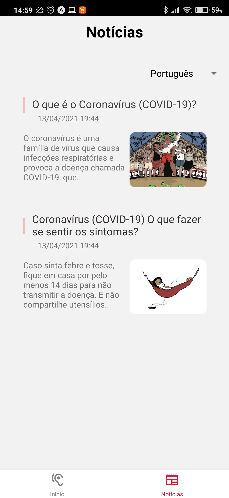
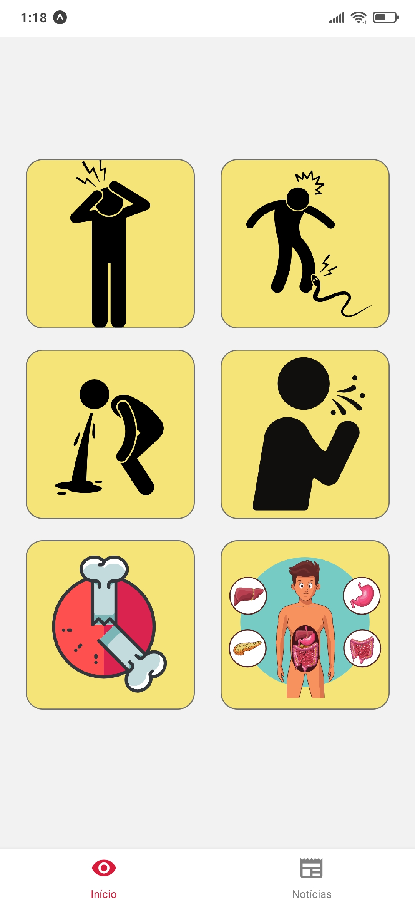

<div align="center">
  
</div>

<p align="center">
    
</p>
<p align="center">
  <a href="#rodando-o-projeto-localmente">Rodando o projeto localmente</a>&nbsp;&nbsp;&nbsp;|&nbsp;&nbsp;&nbsp;
  <a href="#tecnologias-utilizadas">Tecnologias</a>&nbsp;&nbsp;&nbsp;|&nbsp;&nbsp;&nbsp;
  <a href="#autores">Autores</a>
</p>

<div align="center">
  
</div>

O "Conta Comigo" é um projeto idealizado e desenvolvido pela equipe Sarct durante a maratona de inovação Hackathon IL-PCTec.

O Hackathon IL-PCTec foi um evento voltado para o desenvolvimento de soluções para o enfrentamento das barreiras de comunicação linguística para imigrantes, indígenas e surdos no acesso às demandas cotidianas e às políticas públicas no contexto da pandemia, através da construção de um APP no qual essas pessoas possam ter acesso a uma mediação linguística para se comunicar com agentes públicos.

No Brasil, temos que muitos povos indígenas, que assim como imigrantes, não sabem português. Essa situação acaba levando a uma dificuldades contidianas, principalmente relacionadas à comunicação com agentes públicos, o que por consequencia, dificulta o acesso por exemplo à educação, saúde, segurança, defensoria pública.

Devido a pandemia da Covid-19, o acesso aos serviços públicos se tornou ainda mais necessário, e houve ai, um crescimento na necessidade de comunicação. Assim como os povos indígenas e imigrantes, os surdos também acabam por sofrer, encontrarem também uma dificuldade de se comunicar. Temos como algumas dificuldades, o acesso ao auxílio emergencial, e até a tentativar de descrever sintomas em um hospital.

Atrelado a essa dificuldade se comunicar, também temos a dificuldade do acesso a informação. Em português, temos a disposição diversas cartilhas e informes com o objetivo de orientar as pessoas acerca da COVID-19. Com esse material apenas em português, é muito difícil para povos indígenas e imigrantes se manterem informados.

Algumas organização não governamentais buscam levar aos povos indígenas essas cartilhas e informativos em suas respectivas línguas. Durante o período da maratona, tivemos acesso a alguns desses materiais.

Como peça central da promoção desse material em línguas indígenas, temos os tradutores. Sem a presença dos tradutores, não seria possível esse material existir. Temos ainda, as formas de divulgação que não estão centralizadas.

Em busca de solucionar esses diversos problemas, surgiu o Conta Comigo. O nosso objetivo é garantir que os povos indígenas, imigrantes e surdos possuam acesso a informação e comunicação, ajudando a diminuir os casos de contaminação da Covid-19 através da disseminação de informação com qualidade e segurança, e auxiliar na comunicação desses grupos com agentes públicos, tornando o trabalho desses agentes mais rápido e eficaz.

Utilizando das tecnologias digitais, desenvolvemos o Conta Comigo, um aplicativo voltado para a informação em diversas línguas, capaz de ser utilizado através de guia ilustrativo.

<div align="center">
<div>


</div>

Com o objetivo de manter todos informados, o Conta Comigo apresenta em sua página inicial, notícias, guias e cartilhas. Essas publicações podem ser acessadas na língua desejada alterando através de um seletor acima.

<div align="center">
<div>


</div>

Surgiu porém, a necessidade de uma fonte confiável para traduzir esse material para um língua indígena. Como citado, os tradutores são a peça central da existência de materiais traduzidos. Partindo disso, inserimos a funcionalidade "traduzir", que permite a qualquer pessoa que saiba uma língua além do português, traduzir aquela publicação. O nosso objetivo com isso é propagar o voluntariado, mantendo assim, diversas notícias sempre em diversas línguas.

<div align="center">
<div>

</div>

Com o objetivo de auxiliar na comunicação entre indivíduos que não sabem português e agente públicas, criamos mais uma funcionalidade, o guia ilustrativo. No guia ilustrativos, com o objetivo de usufruir da comunicação visual, inserimos desenhos. Através dos desenhos é possível que um indivíduo que não saiba português, indique através das figuras suas necessidades para uma gente público. Utilizando do poder da imagem na comunicação, além de indicar suas necessidades, é possível acessar guias pre definidas com temas que são recorrentes, auxiliando assim tanto o indivíduo que busca se informar, quanto o agente público do que fazer.

<div align="center">
<div>



</div>

## Rodando o projeto localmente

### Pré requisitos

Para executar o software localmente, são necessárias as seguintes ferramentas:

<li>
<a href="https://expo.io/tools#cli">expo</a>
</li>
<li>
  <a href="https://yarnpkg.com/getting-started/install#global-install">yarn</a>
</li>

### Instalação

### 1 - Baixe o repositório

```bash
git clone https://github.com/Hackathon-IL/Sarct.git
```

### 2 - Entre na pasta do projeto

```
cd Sarct
```

### 3 - Instale as dependências


```
cd mobile
yarn
```

### 4 - Execute o mobile

```
cd mobile
yarn start
```

## Tecnologias utilizadas

- [React Native](https://reactnative.dev/) - Framework utilizado no frontent
- [Styled components](https://styled-components.com/) - Estilização de componentes no react native

## Autores

- [João Magalhães](https://github.com/joaovictornm)
- [Richard Viana](https://github.com/richardjlv)
- [Robson Melo](https://github.com/RobinhoRamon)
- [Lucas Rosa](https://github.com/lucasharosa)


## Protótipo da Interface de Usuário

**[Link para o protótipo](https://xd.adobe.com/view/503608f3-53a2-47db-8f84-5ab860150671-0565/specs/)**

## Pitch

**[Link para o pitch](https://youtu.be/bO1l3qfCU0w)**
